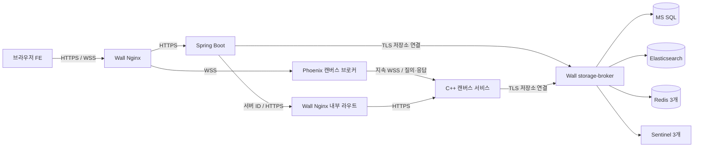
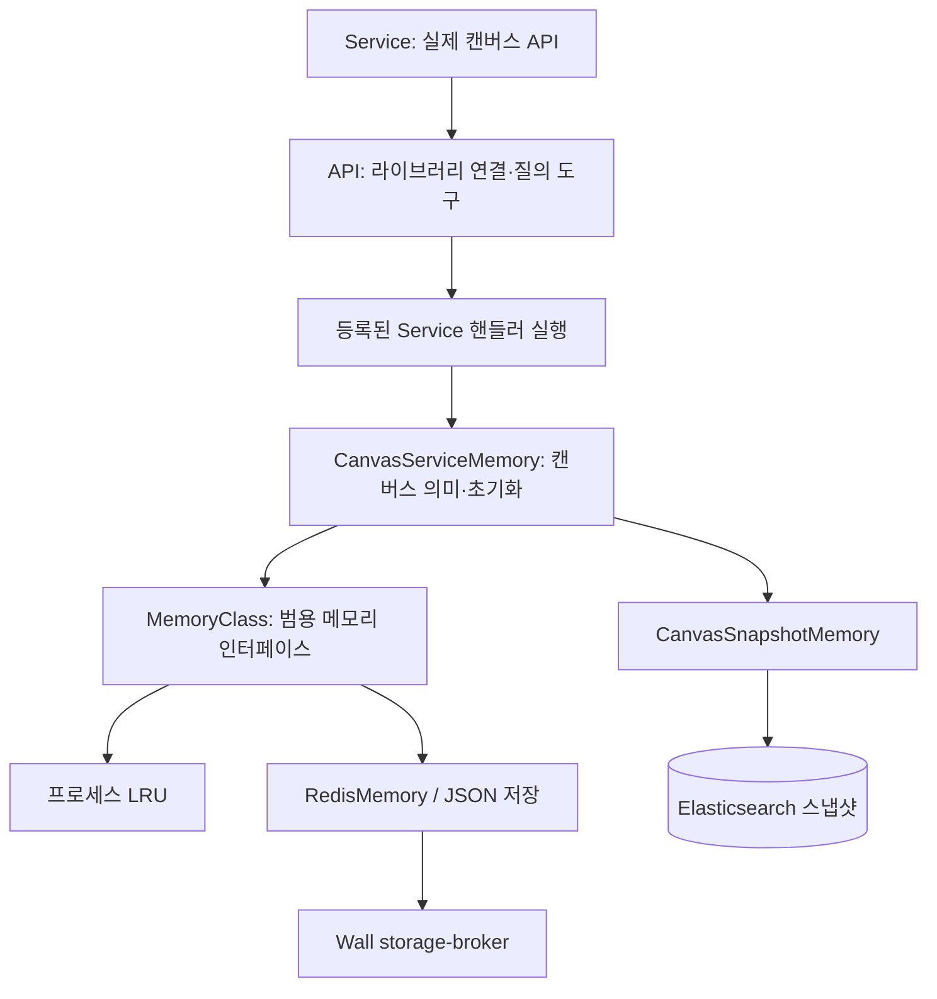

# Agora 인프라 아키텍처와 역할

이 문서는 현재 저장소의 구성과 코드가 정의하는 구조를 설명합니다. 기존 실행 컨테이너는 변경된 소스가 재배포되기 전까지 이전 구조일 수 있습니다. Orchestra의 `inventory`와 배포별 설정을 먼저 비교하십시오.

## 구성과 책임

| 저장소 / 구성 요소 | 담당 역할 | 데이터 또는 상태 | 외부·내부 인터페이스 |
|---|---|---|---|
| project-agora-FE / React·Vite·Pixi.js | 로그인 화면, 캔버스 렌더링, 편집 UI, 브라우저 호스트 동기화 | 편집 중 상태, 재전송 큐, CRDT, 일시적 포인터 | HTTPS, WSS, WebRTC |
| project-agora-BE / Spring Boot | 사용자 인증, 계정·권한·그룹·캔버스 메타데이터, 서버 할당 | SQL 중심 업무 데이터, 검색·캐시 접근 | HTTPS API, JDBC/TLS, ES HTTPS, Redis TLS |
| project-agora-BE / C++ | 캔버스 객체 CRUD, 설정·채팅 처리, 저장소 질의와 캔버스 메모리 | 캔버스 문서, Redis 작업 상태, 프로세스 LRU, ES 스냅샷 | 내부 HTTPS API, 브로커와 지속 WSS |
| project-agora-Wall / Nginx | HTTPS 진입점, 프런트·Spring·Phoenix 전달, 서버 ID 기반 C++ 라우팅 | 정적 라우팅 설정 | HTTPS와 WSS |
| project-agora-Wall / Phoenix | JWT 검증, 업그레이드 허용, 캔버스별 연결 격리, 요청 라우팅·응답·브로드캐스트, 호스트 선출용 시그널링 | 연결·룸·진행 중 요청; 영구 문서 저장 안 함 | 브라우저 WSS, C++ Gun WSS |
| project-agora-Wall / HAProxy storage-broker | 애플리케이션과 SQL·ES·Redis·Sentinel 사이의 TCP 중계 | 라우팅과 연결 상태; 저장소 자격 증명 없음 | TLS 암호문을 그대로 전달하는 TCP 프록시 |
| project-agora-DB / MS SQL | 계정, ACL·그룹, 캔버스 등록·서버 할당·리비전 등 관계 데이터 | DB 및 로그 볼륨 | TDS + 검증된 TLS |
| project-agora-DB / Elasticsearch | 캔버스 스냅샷과 검색·로그 문서 | 인덱스·데이터 볼륨 | HTTPS |
| project-agora-DB / Redis 3개 | 현재 작업 문서와 고속 메모리 저장소, 복제 | Redis JSON, AOF 설정, 비동기 복제 | 인증된 TLS RESP |
| project-agora-DB / Sentinel 3개 | Redis 현재 primary 탐색·장애 감지·선출 | Sentinel 토폴로지 상태 | 인증된 TLS RESP |
| project-orchestra | 구조 문서, 순차 기동, 장애 주입·복구, Locust·자원 측정 | 시험 설정, 장애 저널, CSV/HTML/JSONL | Docker CLI 및 검증 대상의 TLS 인터페이스 |

포인터·레이저·음성 등은 별도의 WebRTC P2P 경로를 사용합니다. 위 도표의 저장 객체 경로와 구분해야 합니다. Orchestra의 관측 요청은 시험 트래픽이며 운영 데이터 경로를 대체하지 않습니다.

## 네트워크와 경유 경로

| Docker 네트워크 | 참여 구성 | 목적 |
|---|---|---|
| agora-web | FE, Nginx | 프런트 전달 |
| agora-services / 172.23.0.0/16 | Spring, C++, Phoenix, Nginx, storage-broker | 애플리케이션 간 Wall 경유 통신 |
| agora-net / 172.21.0.0/16 | SQL, Elasticsearch, storage-broker | SQL·검색 저장소 구간 |
| agora-redis-ha / 172.20.0.0/16 | Redis, Sentinel, storage-broker 및 관리 도구 | Redis 복제·Sentinel 구간 |

부하 컨테이너는 `agora-services`와 `agora-web`에만 붙습니다. 저장소 네트워크에는 붙지 않습니다. Docker 네트워크 격리는 서로 다른 애플리케이션들이 보안상 완전히 분리된다는 뜻은 아니며, 같은 서비스 네트워크 안에서의 접근 제어는 인증·토큰·프록시 허용 목록이 담당합니다.

외부 기본 진입점은 Nginx HTTPS이며 기본 공개 매핑은 `8443 → 443`입니다. 실제 접속 주소는 배포 설정에 따라 달라집니다. 프런트는 내부 HTTPS 5173, Spring은 HTTPS 8080, Phoenix는 HTTPS/WSS 4443을 사용합니다.

Spring은 C++ 주소에 바로 접속하지 않고 Nginx 내부 HTTPS 8444의 `/internal/cpp/servers/{serverId}/...`에 요청합니다. 서버 ID와 upstream은 Wall의 `cpp-routes.conf`로 연결됩니다. 내부 토큰이 필요하며 외부 공개 경로의 `/internal/` 및 미등록 ID는 거절합니다.

브라우저 캔버스 경로는 `/wss/port/{logicalPort}/canvas/{canvasId}`입니다. 논리 포트는 할당 식별자이지 브라우저가 C++ 포트로 직접 연결한다는 의미가 아닙니다. Phoenix는 대상 논리 포트별 지속 Gun WSS 연결을 통해 C++ `/broker/queries`에 요청을 전달합니다. 요청·캔버스·연결 ID로 응답을 원래 요청자에게 돌려주며 응답 순서가 바뀌어도 라우팅할 수 있습니다.

저장소 경로도 Wall을 경유합니다.

| 애플리케이션 측 목적지 | Wall 내부 실제 upstream | 의미 |
|---|---|---|
| agora-mssql:1433 | mssql:1433 | 서비스 네트워크의 SQL 이름은 프록시 별칭 |
| agora-elasticsearch:9200 | elasticsearch:9200 | ES HTTPS 암호문 중계 |
| agora-storage-broker:16379 / 16380 / 16381 | Redis 고정 슬롯 3개:6379 | 실제 primary는 Sentinel 결과에 따라 선택 |
| agora-storage-broker:26379 / 26380 / 26381 | Sentinel 고정 슬롯 3개:26379 | 인증된 primary 탐색 |

Sentinel이 알려주는 원래 Redis IP는 인증서 검증과 노드 식별에 사용하고, TCP 접속 대상은 Wall 슬롯으로 바꿉니다. 등록되지 않은 새 primary는 직접 접속으로 우회하지 않고 실패합니다. 노드 추가 시 라우팅·인증서·허용 목록을 함께 갱신해야 합니다. 프록시 upstream은 별도 서비스 이름을 사용하여 자기 자신의 DNS 별칭으로 재접속하는 루프를 피합니다.

## 인증과 캔버스 격리

Spring은 로그인과 캔버스 접근 권한을 확인한 후 짧은 수명의 캔버스 접근 JWT를 발급합니다. JWT는 HS256으로 **서명된 토큰**이며 암호화된 문서가 아닙니다. 서명키는 Spring과 Phoenix만 보유하며 C++이나 Orchestra에 배포하지 않습니다.

Phoenix는 WebSocket 업그레이드 전에 서명·만료·캔버스 ID·클라이언트 IP·서버 할당 해시 등을 검증합니다. 이어 C++에 연결 검증을 위임하여 활성 사용자·멤버십·리비전과 초기 캔버스 정보를 확인하고 성공한 연결만 허용합니다. C++은 JWT 해독 서버가 아니라 신뢰된 브로커가 전달한 principal과 캔버스 질의를 처리합니다.

룸은 논리 포트와 캔버스 ID로 격리합니다. 사용자 입력이 서버 라우팅 ID나 다른 사용자의 principal을 덮어쓰지 못하도록 브로커가 경로를 결정합니다. 캔버스 설정·권한 리비전이 바뀌면 재접속과 새 토큰이 필요할 수 있습니다. 시험도 전용 계정·캔버스·권한을 이용해야 합니다.

## 저장 객체의 호스트 동기화

브라우저 참여자 중 자격 있는 peer ID의 우선순위를 비교하는 **우선순위 기반 선출(Bully 스타일)**을 사용합니다. 현재 우선순위는 문자열 peer ID의 큰 값이며 먼저 접속한 사람이라는 의미는 아닙니다. 관리자 또는 필요한 모든 그룹 권한을 가진 참여자가 호스트 후보가 됩니다. Raft나 다수결 합의·영구 로그 시스템은 아닙니다.

1. 첫 연결은 최신 초기 상태를 받을 때까지 편집을 잠급니다.
2. 사용자의 저장 객체 변경은 큐에 들어가며 한 번에 하나의 요청을 호스트에게 보냅니다.
3. 호스트는 사용자별 요청 카운트를 검사하고 변경을 메모리에 반영한 뒤 요약 ACK를 보냅니다. 성공 ACK를 받을 때까지 다음 요청을 보내지 않습니다.
4. 호스트는 확정한 내역을 참여자에게 전달하고 변경된 객체를 서버 저장 경로로 보냅니다.
5. 호스트 연결이 끊어지면 상태 알림을 표시하고 새 작업은 큐에 쌓습니다. 새 호스트 연결·동기화가 끝난 뒤 전송을 재개합니다.

카운트는 사용자 세션 기준이며 새 호스트로 바뀌어도 감소하지 않습니다. 새 사용자 연결은 새 카운트 흐름을 시작합니다. 호스트는 각 사용자별 마지막 성공 카운트와 필요한 요약 상태를 유지하여 요청 전체를 무한히 저장하지 않습니다. 이전 카운트의 재실행을 막고 재전송에 응답하지만 전역적인 영구 exactly-once 기록은 아닙니다.

현재 코드의 `HOST_PEER_FPS=30`, `HOST_SAVE_FPS=10`은 각각 **30Hz와 10Hz**입니다. 약 33ms마다 참여자 전송, 약 100ms마다 서버 저장을 시도하는 주기이며, 렌더링 30프레임마다/10프레임마다 실행한다는 의미는 아닙니다. 실제 전송은 변경·ACK·백프레셔에 따라 달라집니다.

**호스트의 `host_ack accepted`는 브라우저 메모리 수용 확인입니다.** C++ 저장 작업의 `host_batch_result`와 동일하지 않습니다. ACK 후 호스트가 종료되는 실험에서는 단순 화면 변경뿐 아니라 새 호스트·재접속 사용자의 상태와 서버 반영 완료도 따로 검증해야 합니다.

마우스·레이저·음성은 저장 객체 호스트를 경유하지 않는 WebRTC P2P 정보입니다. Phoenix는 관련 시그널링을 중계하지만 저장소나 C++에 모든 미디어를 보관하지 않습니다. Docker 장애만으로 브라우저 호스트 종료를 충분히 시험할 수 없으므로 다중 브라우저 실험도 필요합니다.

## C++ 서비스와 메모리 계층

API 계층은 등록된 서비스 콜백을 호출하며 캔버스 메모리를 직접 알지 않습니다. 서비스 핸들러가 용도별 메모리를 참조합니다.

`CanvasServiceMemory`는 캔버스 문서를 Elasticsearch에서 불러와 범용 `MemoryClass`에 채우고 캔버스 업무에 맞게 취급합니다. 범용 계층은 서비스 용어에 종속되지 않으며 Redis와 LRU 선택을 호출자에게 숨깁니다. SQL 레지스트리 및 ES 스냅샷 접근도 별도의 서비스 메모리 책임으로 분리됩니다.

현재 MemoryClass는 Redis JSON을 기본 저장소로 사용하며 반복 접근한 항목을 LRU로 승격합니다. 기본 캐시 한도는 문서 256개, 문서당 항목 64개, 항목당 256KiB이며 설정에 따라 달라집니다. 변경은 dirty 상태로 지연 반영될 수 있고 flush·퇴출·실패 시의 무효화가 관리됩니다. LRU는 각 프로세스 내부 메모리이며 C++ 프로세스 간 분산 캐시 일관성 기능을 뜻하지 않습니다.

C++ 쓰기 성공 응답은 적용 및 해당 캔버스 Redis flush 성공 이후에 나갑니다. 이것만으로 Elasticsearch 스냅샷, 모든 Redis replica의 반영, 디스크 fsync까지 보장되지는 않습니다. Redis 복제는 비동기이며 현재 질의 경로는 `WAIT/WAITAOF` 기반 커밋 장벽을 제공하지 않습니다. ES 스냅샷 저장은 캔버스 unload·정상 종료 등 별도 단계입니다. Redis 실패 시 불완전한 최신 상태를 ES에 덮어쓰는 경로를 차단합니다.

배치 요청은 사전 검증하지만 여러 저장소를 묶는 원자적 트랜잭션은 아닙니다. 중간 실패 시 적용된 수량이 반환될 수 있습니다. `QUERY_OUTCOME_UNKNOWN`은 재실행 안전성이 불확실하다는 의미이므로 무조건 자동 재전송하면 안 됩니다. 요청 ID는 라우팅 상관관계용이며 영구 멱등성 로그를 대체하지 않습니다.

## TLS 경계

HTTPS/WSS, Redis·Sentinel TLS, Elasticsearch HTTPS 구간은 TLS 1.3과 CA·호스트명 검증을 기본으로 사용합니다. storage-broker는 TLS를 종료하지 않고 그대로 전달합니다. 평문 HTTP/WS로 되돌아가는 경로를 시험 도구에 제공하지 않습니다.

**현재 SQL Server 2022 Linux는 TLS 1.2 예외 구간입니다.** JDBC/ODBC와 C++ SQL 연결의 암호화·CA·호스트명 검증은 유지합니다. TLS 1.3을 전체 구간에 적용하려면 이를 지원하는 SQL 배포로 별도 업그레이드·검증해야 합니다. 프록시 추가만으로 SQL의 지원 버전이 바뀌지는 않습니다. [Microsoft의 버전별 제한 설명](https://learn.microsoft.com/en-us/sql/linux/sql-server-linux-known-issues?view=sql-server-ver17#tls-13-not-supported-on-sql-server-2022)

인증서는 직접 생성·삽입하며 서비스별 SAN과 원래 저장소 노드 식별자를 포함해야 합니다. Orchestra는 공개 CA만 전달받고 SQL CA를 시험 이미지의 신뢰 저장소에 추가합니다. Phoenix health 직접 시험은 현재 공용 인증서에 맞춰 `tls_server_name=agora-nginx`를 사용합니다. 별도 Phoenix 인증서를 사용하는 배포에서는 이 값을 해당 SAN으로 바꾸십시오. 검증을 끄는 우회는 사용하지 않습니다.

## 규모·장애 관점의 현재 한계

현재 기본 배포에는 Nginx, Phoenix, C++, storage-broker, SQL, ES의 단일 노드가 포함됩니다. 코드의 큐 제한이나 Redis Sentinel 구성만으로 모든 서비스가 고가용성이 되지는 않습니다. 특히 storage-broker는 저장소 전체 접근의 공통 장애 지점입니다.

브로커는 브라우저 메시지 12MiB, 연결별 메시지 속도 제한, 룸 큐 128개/16MiB, C++ 연결별 진행 요청 64개/32MiB 및 타임아웃으로 메모리를 제한합니다. C++은 worker·대기 작업·배치·WebSocket 백프레셔를 제한합니다. 이 수치는 현재 기본 설정이며 처리량 보장이 아닙니다. 실제 병목은 CPU, 연결 수, SQL 풀, Redis 복제 지연, ES I/O, 호스트 브라우저 성능에 따라 달라집니다.

storage-broker의 구성 검사 healthcheck는 설정이 유효한지 보는 검사입니다. backend TCP 연결 성공도 인증·쿼리 성공을 뜻하지 않습니다. 컨테이너 `healthy`와 사용자 요청 성공을 별도로 관측해야 합니다. Redis Sentinel 선출 이후에도 이전 primary의 역할·애플리케이션 재연결·작업 결과를 확인해야 합니다.

다중 인스턴스 확대에는 서버 ID 라우팅, 캔버스 소유권·할당, Phoenix 룸 분산, 저장소 HA 및 프록시 중복화를 함께 설계해야 합니다. Orchestra의 시험은 해당 설계를 검증하는 도구이며 자동으로 HA 구성을 만들어주지는 않습니다.

## 코드와 운영 문서

- [Wall 구성·Nginx](../../project-agora-Wall/README.md), [브로커 프로토콜](../../project-agora-Wall/BROKER_PROTOCOL.md), [저장소 프록시](../../project-agora-Wall/STORAGE_BROKER.md)
- [BE 서비스](../../project-agora-BE/README.md), [C++ API 개발](../../project-agora-BE/cpp/API_DEVELOPMENT.md)
- [FE TLS 설정](../../project-agora-FE/docs/TLS_SETUP.md), [호스트 세션 코드](../../project-agora-FE/src/canvas/host/HostCanvasSession.js)
- [DB 구성](../../project-agora-DB/README.md)

위 링크는 저장소를 나란히 clone한 로컬 배치를 기준으로 합니다.

## 한국어·의미 검색 노드

BE의 E5 ONNX worker는 Wall storage-broker를 통해 ES 원본의 이름·설명·ID만 읽고 별도 `canvas-search` projection을 갱신합니다. Spring은 Wall Nginx 내부 HTTPS 경로에서 검색어 임베딩을 받고 Nori BM25·원본 BM25·근사 k-NN 순위를 합산한 뒤 원본 summary로 재확인합니다. 원본 캔버스 객체·채팅·비밀번호는 임베딩하지 않습니다. Worker는 기본 30초 대기 후 메타데이터를 다시 순회하며 바뀐 fingerprint만 재임베딩하므로 검색 반영은 비동기입니다. 임베딩 장애 시 키워드 검색을 유지합니다. 모델 실행 CPU·메모리와 전체 메타데이터 순회 비용을 추가로 관찰해야 합니다. [schema·운영·검증](../../project-agora-DB/elasticsearch/SEARCH.md).
